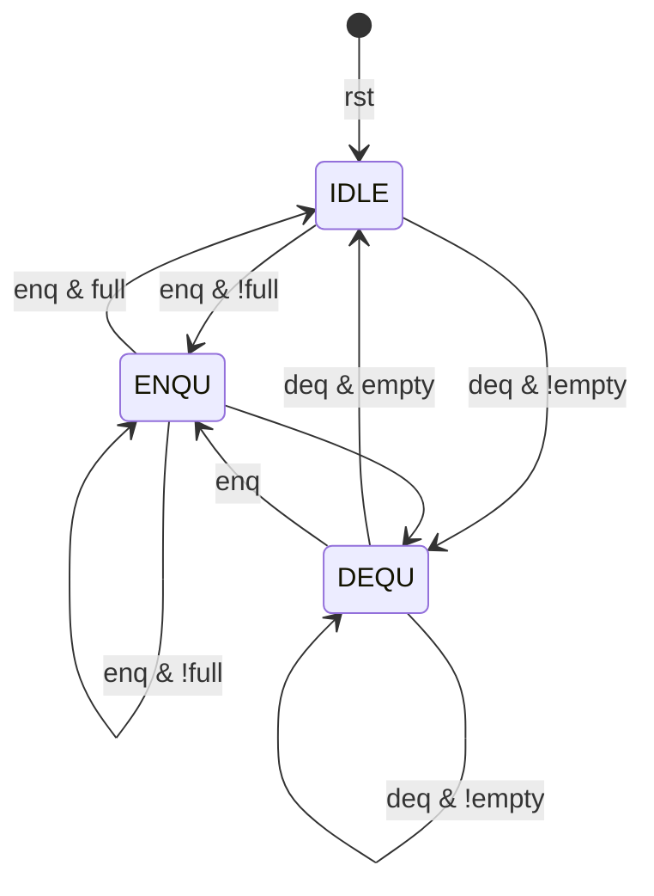

# Lab2

## T1

* 完成寄存器堆功能仿真

  

## T2

* 比较分布式寄存器和块式寄存器的区别
  

## T3

* 顶层模块分别IP例化块式16 x 8位单端口RAM三种不同的操作模式
	

## T3

```mermaid
stateDiagram-v2
[*] --> IDLE: rst
IDLE --> ENQU: enq & !full
ENQU --> ENQU: enq & !full
ENQU --> IDLE: enq & full
IDLE --> DEQU: deq & !empty
DEQU --> DEQU: deq & !empty
DEQU --> IDLE: deq & empty
DEQU --> ENQU: enq
ENQU --> DEQU
```

