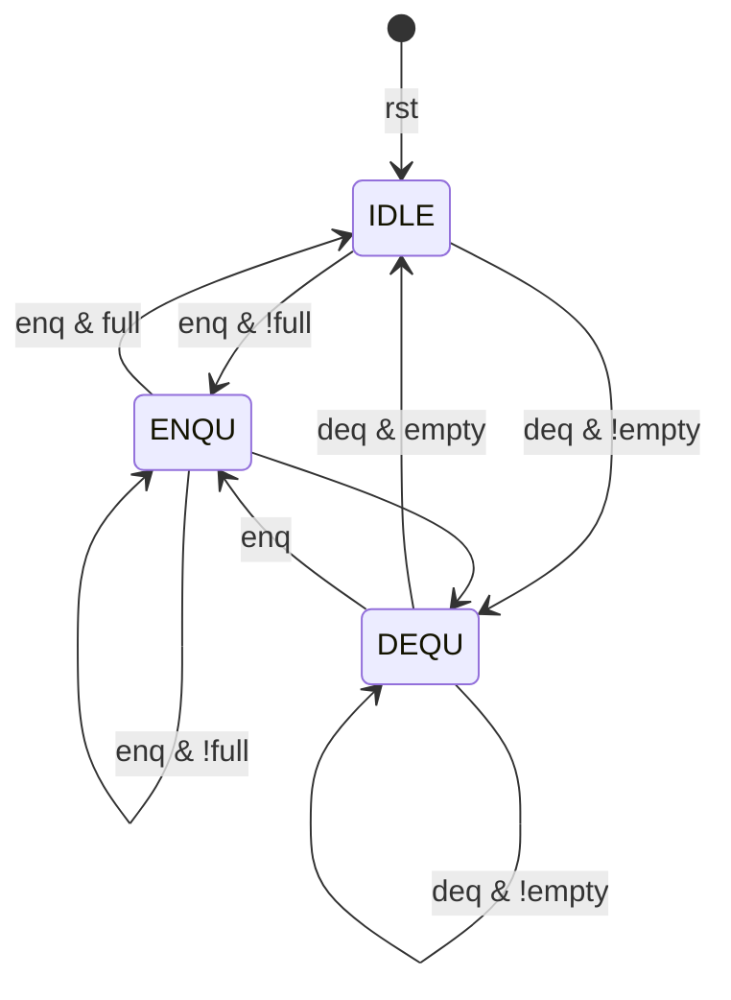

# Lab2

## 实验目的

* 本次实验需要掌握寄存器的原理
* 了解IP核的创建方法以及不同的Memory Block

## 逻辑设计

### 寄存器堆设计

该部分较为简单，我们只需要注意让r0时刻保持为0即可

```verilog
`timescale 1ns / 1ps

module register_file
#(parameter WIDTH = 32)
( input clk, 
input[4 : 0] ra0,
output[WIDTH - 1 : 0] rd0,
input[4: 0] ra1, 
output[WIDTH - 1 : 0] rd1,
input[4 : 0] wa, 
input we,
input[WIDTH - 1 : 0] wd
);

//寄存器堆的0号地址恒为0
reg [WIDTH - 1 : 0] regfile[0 : 31];

assign rd0 = regfile[ra0], rd1 = regfile[ra1];

always@(posedge clk) 
begin
    if(we&&wa) regfile[wa] <= wd;
    else regfile[0] <= 32'b0;
end
endmodule
```

### FIFO队列

FIFO模块的数据通路为PPT上的数据通路，值得注意的是，我们为了完成选做的内容，我们增加了一条数据通路，我们将RD和WD也传给了SDU


并且我们画出了FIFO的状态转换图，如下图所示



我们只需要按照上述状态图写出对应的三段式即可，值得注意的是，我们新增加了两个状态分别为`ENQU_tmp`和`DEQU_tmp`，这两个状态作为过渡状态，只运行一个时钟周期，因为我们希望在这两个周期运行一次相应操作

我们接下来给出LCU对应的代码逻辑

```verilog
`timescale 1ns / 1ps

module LCU(
input clk,
input rst,
input [3:0] in,
input enq,
input deq,
input [3:0] rd0,
output reg [2:0] ra0,
output [3:0] out,
output reg full,
output reg empty,
output reg [7:0] valid,
output reg [2:0] wa,
output reg [3:0] wd,
output reg we,
output reg [2:0] RP,
output reg [2:0] WP
);
parameter IDLE = 3'b000, ENQU = 3'b001, DEQU = 3'b010, ENQU_tmp = 3'b011, DEQU_tmp = 3'b100;
reg [2:0] state, next_state;

always@(posedge clk or posedge rst)
    if (rst) begin
        state <= IDLE;
    end
    else
        state <= next_state;

always@(*)
    if(deq | enq)
        case(state)
            IDLE: begin
                if (enq & !full) 
                    next_state = ENQU_tmp;
                else if (deq & !empty)
                    next_state = DEQU_tmp;
                else
                    next_state = IDLE;
            end
            ENQU: begin
                if (enq & !full) 
                    next_state = ENQU_tmp;
                else if (deq)
                    next_state = DEQU_tmp;
                else
                    next_state = IDLE;
            end
            DEQU: begin
                if (enq)
                    next_state = ENQU_tmp;
                else if (deq & !empty) 
                    next_state = DEQU_tmp;
                else
                    next_state = IDLE;
            end
            default next_state = IDLE;
        endcase
    else
        case(state)
            ENQU_tmp:
                next_state = ENQU;
            DEQU_tmp:
                next_state = DEQU;
            default: 
                next_state = state;
        endcase


wire [2:0] WP_plus1, RP_plus1;
assign WP_plus1 = WP + 3'b1;
assign RP_plus1 = RP + 3'b1;
assign out = rd0;
always@(posedge clk) begin
    if(rst) begin
        RP <= 3'b000;
        WP <= 3'b000;
        valid <= 8'b00000000;
        full <= 0;
        empty <= 1;
    end
    else
        case(state)
            ENQU_tmp: begin
                    wa <= WP;
                    wd <= in;
                    we <= 1;
                    WP <= WP + 1;
                    valid[WP] <= 1;
                    full <= (WP_plus1 == RP);
                    empty <= 0;
                end
            DEQU_tmp: begin
                    we <= 0;
                    ra0 <= RP;
                    RP <= RP + 1;
                    valid[RP] <= 0;
                    full <= 0;
                    empty <= (RP_plus1 == WP);
                end
            default:
                we <= 0;
        endcase
end
endmodule
```

接下来是SDU的代码块逻辑，该逻辑可以实现选座部分的内容

```verilog
module SDU(
    input clk,rst,
    input [7:0] valid,
    input [3:0] rd1,
    input [2:0] RP,
    input [2:0] WP,
    output [2:0] ra1,
    output reg [2:0] an,  //数码管选择
    output reg [3:0] seg  //数码管数据
);
reg [23:0] cnt;

assign ra1=an+RP;

always@(posedge clk)
begin
    if(rst)begin//复位时显示0
        an<=0;
        seg<=0;
    end
    else begin
        if(valid==0)begin
            an <=0;
            seg <=0;
        end
        else begin
        if(cnt==0)begin
            if(an>=(((WP>RP)?WP-RP:8-RP+WP)-1)) an<=0;
            else an<=an+1;
        end
        else begin
            an<=an;
        end 
        seg <= rd1;
    end
    end

    if(cnt>=100000)//控制选择信号
        cnt<=0;
    else
        cnt<=cnt+1;
 
end
endmodule
```

## 仿真结果与分析

### T1

* 完成寄存器堆功能仿真，我们可以看到寄存器在r0处不论输入等于几，均为0不变

  

### T2

* 比较分布式寄存器和块式寄存器的区别，我们可以从下图中看出，他们最主要的区别在于读的时候一个是同步读取，一个是异步读
  

### T2

* 顶层模块分别IP例化块式16 x 8位单端口RAM三种不同的操作模式

* 我们可以看出Read_first模式中，会读取内存中旧的值

* 在Write_first模式中，会读取新写入的值

* 在Default模式中，只会在使能en=0的时候读取内存中的值，并且保持不变

  

## T3


如图所示，我们设计仿真实验，先将所有的数字入队列，然后再将它们出队列，完成实验的仿真

## 电路设计与分析


我们画出RTL图，将我们的数据通路展示出来

## 总结

* 本次实验附加实验较为繁琐
* 本次实验收获较多

